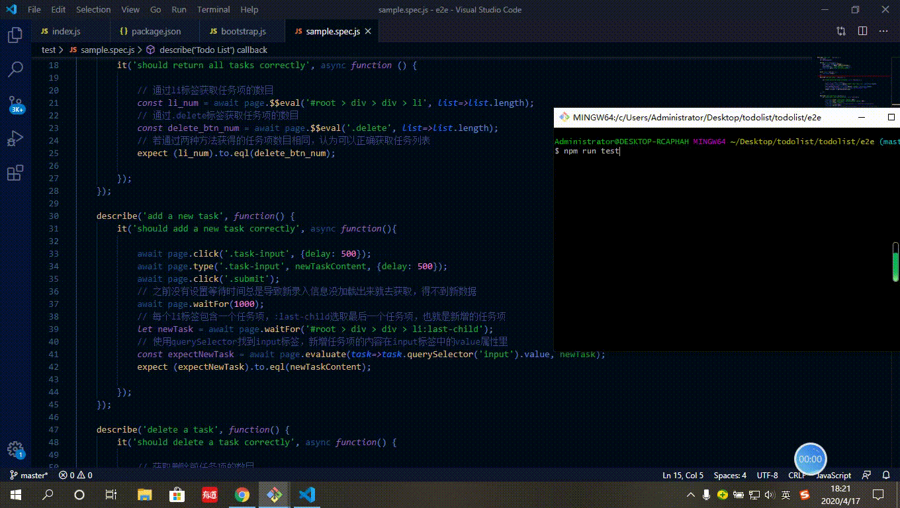

## 自动化测试

</img>

**显示任务列表**

> #root > div > div > li    >是子选择器，该标签可以获得所有li标签

> .delete      .name是class选择器，该标签获得所有删除按钮的数目

> 二者返回值相同认为可以正确的获得任务列表

**添加任务项**

> 点击输入框,输入信息,提交
> await page.click('.task-input', {delay: 500});  
> await page.type('.task-input', newTaskContent, {delay: 500});
> await page.click('.submit');

> 获取任务列表最后一项的内容信息，最后一项是添加的任务项
> let newTask = await page.waitFor('#root > div > div > li:last-child');
> const expectNewTask = await page.evaluate(task=>task.querySelector('input').value, newTask);

> 若获得的最后一任务项内容与输入内容一致，认为正确的添加任务项

**删除任务项**

> 获取删除前的任务项数目
> let todoList = await page.$$('#root > div > div > li');
> const len1 = todoList.length;

> 删除一个任务项
> await page.evaluate(()=> {
                document.querySelector('.delete').click()
            });
			
> 获得删除后的任务项数目
> const len2 = await page.$$eval('#root > div > div > li', list=>list.length);

> 若删除前任务项数目比删除后任务项数目多1，认为正确的删除任务项

**编辑任务项**

> 点击最后一个任务的编辑按钮
> await page.click('#root > div > div > li:last-child .edit', {delay:500});

> 点击最后一个任务的输入框三下使该任务原有内容被选中
> let updatedTask = await page.waitFor('#root > div > div > li:last-child');
> const editArea = await page.$('#root > div > div > li:last-child > div');
> await editArea.click({clickCount: 3});

> 在被选中的原有内容上进行编辑，修改为新的内容
> await editArea.type(newTaskContent, {delay: 500});

> 获取编辑完成后该任务项的新的内容
> await page.click('#root > div > div > li:last-child .edit', {delay:500});
> const expectUpdatedTask = await page.evaluate(task=>task.querySelector('input').value, updatedTask);

> 若获取到的新的内容与输入内容一致则认为编辑功能测试是正确的
> expect (expectUpdatedTask).to.eql(newTaskContent);